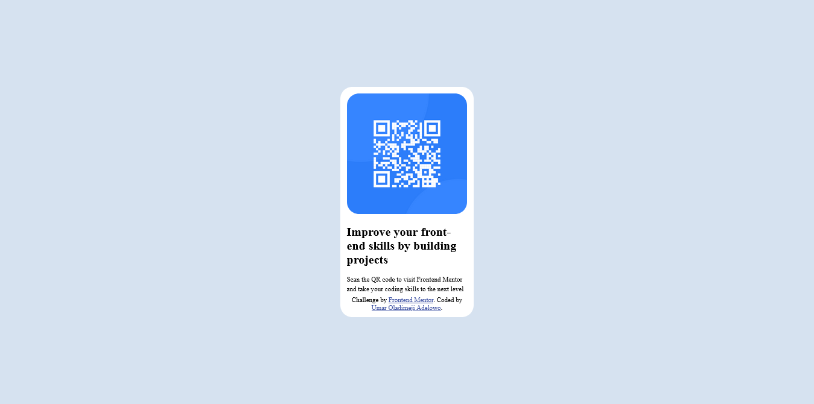

# Frontend Mentor - QR code component solution

This is a solution to the [QR code component challenge on Frontend Mentor](https://www.frontendmentor.io/challenges/qr-code-component-iux_sIO_H). Frontend Mentor challenges help you improve your coding skills by building realistic projects. 

## Table of contents

- [Overview](#overview)
  - [Screenshot](#screenshot)
  - [Links](#links)
- [My process](#my-process)
  - [Built with](#built-with)
  - [What I learned](#what-i-learned)
  - [Continued development](#continued-development)
  - [Useful resources](#useful-resources)
- [Author](#author)
- [Acknowledgments](#acknowledgments)

**Note: Delete this note and update the table of contents based on what sections you keep.**

## Overview

### Screenshot

### Links

- Solution URL: [solution URL here](index.html)
- Live Site URL: [Add live site URL here](https://your-live-site-url.com)

## My process

### Built with

- Semantic HTML5 markup
- CSS custom properties
- Flexbox
- Mobile-first workflow

### What I learned

I learned to use flexible boxes layout to vertically and horizontally center a component in css and also how to resize images to contain their parent elements.
also. I learned how to make elements respond to diiferent viewport width they find themselves through media queries.

### Continued development

Flexbox layout and CSS grid

- Frontend Mentor - [@hullaah](https://www.frontendmentor.io/profile/hullaah)
- Twitter - [@oladimejiAdelo1](https://www.twitter.com/oladimejiAdelo1)

